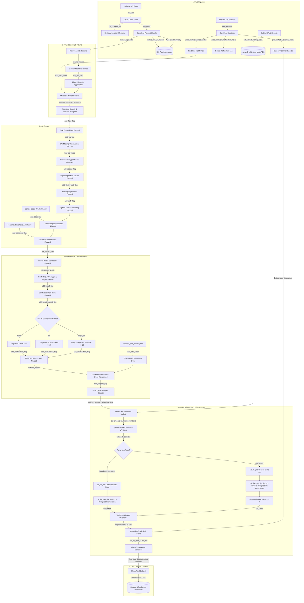

# ROSSyndicate Water Quality Tools

```mermaid
graph TD
	%% Ingest & API Entry Points
	subgraph 1. Data Ingestion
	API_HV[HydroVu API Cloud] -->|hv_auth| OAuth[OAuth Client Token]
	OAuth -->|hv_locations_all| HV_Sites[HydroVu Location Metadata]
	OAuth -->|api_puller| Pull_API[Download Parquet Chunks]
    
    %% Tracker subsystem
    Pull_API -->|update_hv_api_tracker| Tracker_File[(HV_Tracking.parquet)]
    Tracker_File -->|Auto-Disable / Retry| Pull_API

    %% mWater subsystem
    API_MW[mWater API Platform] -->|load_mWater| MW_Raw[Raw Field Database]
    MW_Raw -->|grab_mWater_sensor_notes| Notes_Visit[Field Site Visit Notes]
    MW_Raw -->|grab_mWater_malfunction_notes| Notes_Mal[Sonde Malfunction Log]
    MW_Raw -->|grab_mWater_cleaning_notes| Notes_Clean[Sensor Cleaning Records]

    %% Calibration Reports
    Cal_Logs[In-Situ HTML Reports] -->|cal_extract_markup_data| Cal_Collate[(munged_calibration_data.RDS)]
end

%% Preprocessing Layer
subgraph 2. Preprocessing & Tidying
    Pull_API -->|munge_api_data| Standardized_Raw[Raw Sensor Dataframe]
    Standardized_Raw -->|fix_site_names| Clean_Names[Standardized Site Names]
    Clean_Names -->|tidy_api_data| Aggregated_15[15-min Rounded Aggregates]
    Notes_Visit -->|add_field_notes| Join_Visit[Metadata-Joined Dataset]
    Aggregated_15 --> Join_Visit
    Join_Visit -->|generate_summary_statistics| Stats_Df[Statistical Bounds & Seasons Assigned]
end

%% QAQC Tier 1
subgraph 3. Tier 1 QAQC Flagging [Single-Sensor]
    Stats_Df -->|add_field_flag| F1[Field Crew Visited Flagged]
    F1 -->|add_na_flag| F2[NA / Missing Observations Flagged]
    F2 -->|find_do_noise| F3[Dissolved Oxygen Noise Identified]
    F3 -->|add_repeat_flag| F4[Repeating / Stuck Values Flagged]
    F4 -->|add_depth_shift_flag| F5[Housing Depth Shifts Flagged]
    F5 -->|add_drift_flag| F6[Optical Sensor Biofouling Flagged]

    %% External Thresholds
    Threshold_Spec[sensor_spec_thresholds.yml] -->|add_spec_flag| F7[Technical Spec Violations Flagged]
    Threshold_Season[seasonal_thresholds_virridy.csv] -->|add_seasonal_flag| F8[Seasonal Out-of-Bound Flagged]
    F6 --> F7
    F7 --> F8
end

%% QAQC Tier 2 & 3
subgraph 4. Tier 2 & 3 QAQC Flagging [Inter-Sensor & Spatial Network]
    F8 -->|add_frozen_flag| I1[Frozen Water Conditions Flagged]
    I1 -->|intersensor_check| I2[Conflicting / Overlapping Flags Resolved]
    I2 -->|add_burial_flag| I3[Sonde Sediment Burial Flagged]

    %% Unsubmerged branching
    I3 -->|add_unsubmerged_flag| I4{Check Submersion Method}
    I4 -->|depth| US_D[Flag when Depth <= 0]
    I4 -->|sc| US_S[Flag when Specific Cond <= 10]
    I4 -->|depth_sc| US_DS[Flag on Depth <= 0 OR SC <= 10]

    US_D & US_S & US_DS -->|add_malfunction_flag| I5[Metadata Malfunctions Merged]

    %% Network Tier 3
    Order_Yaml[template_site_orders.yaml] -->|load_site_order| Network_Topology[Downstream Watershed Order]
    I5 -->|network_check| Spatial_QC[Upstream/Downstream Cross-Referenced]
    Network_Topology --> Spatial_QC
    Spatial_QC -->|add_suspect_flag| QC_Complete[Final QAQC Flagged Dataset]
end

%% Calibration Correction
subgraph 5. Back-Calibration & Drift Correction
    QC_Complete -->|cal_join_sensor_calibration_data| Joined_Cal[Sensor + Calibrations Linked]
    Cal_Collate --> Joined_Cal

    Joined_Cal -->|cal_prepare_calibration_windows| Cal_Chunks[Split into Good Calibration Windows]

    %% Back calibration routing
    Cal_Chunks -->|cal_back_calibrate| Route_Param{Parameter Type?}
    Route_Param -->|Standard Parameters| Inv_LM[cal_inv_lm: Generate Raw Mean]
    Inv_LM --> Weighted_Lin[cal_lin_trans_lm: Temporal Weighted Interpolation]

    Route_Param -->|pH Sensor| pH_LM[cal_lm_pH: Convert pH to mV]
    pH_LM --> pH_Lin[cal_lin_trans_inv_lm_pH: Temporal Weighted mV Interpolation]
    pH_Lin --> pH_Select[Slice dual-slope split at pH 7]

    Weighted_Lin & pH_Select -->|cal_check| Verified_Cal[Verified Calibrated Dataframe]

    %% Drift correction subsystem
    Verified_Cal -->|Segment Drift Chunks| Drift_Splt[groupdata2::splt: Drift Events]
    Notes_Clean -->|Extract post-clean value| Drift_Splt
    Drift_Splt -->|cal_exp_one_point_drift| Final_Out[Linear/Exponential Correction]
end

%% Final Stage
subgraph 6. Data Compile & Output
    Final_Out -->|final_data_binder / select columns| Output_Compiled[Clean Final Dataset]
    Output_Compiled -->|Write Parquet / CSV| Disk[(Staging & Production Directories)]
end
```
