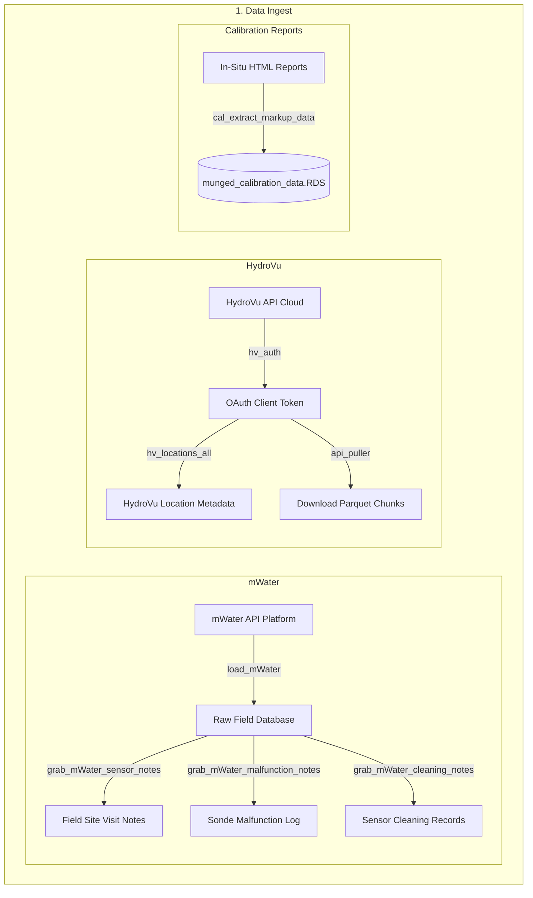

# ROSSyndicate Water Quality Tools

```mermaid
flowchart TD
	subgraph 1. Data Ingest
		subgraph mWater
			direction TB
			API_MW[mWater API Platform] -->|load_mWater| MW_Raw[Raw Field Database]
	    MW_Raw -->|grab_mWater_sensor_notes| Notes_Visit[Field Site Visit Notes]
	    MW_Raw -->|grab_mWater_malfunction_notes| Notes_Mal[Sonde Malfunction Log]
	    MW_Raw -->|grab_mWater_cleaning_notes| Notes_Clean[Sensor Cleaning Records]
	  end
	  subgraph HydroVu
		  direction TB
		  API_HV[HydroVu API Cloud] -->|hv_auth| OAuth[OAuth Client Token]
			OAuth -->|hv_locations_all| HV_Sites[HydroVu Location Metadata]
			OAuth -->|api_puller| Pull_API[Download Parquet Chunks]
		end
		subgraph Calibration Reports
			direction TB
			Cal_Logs[In-Situ HTML Reports] -->|cal_extract_markup_data| Cal_Collate[(munged_calibration_data.RDS)]
		end
	end 
```
